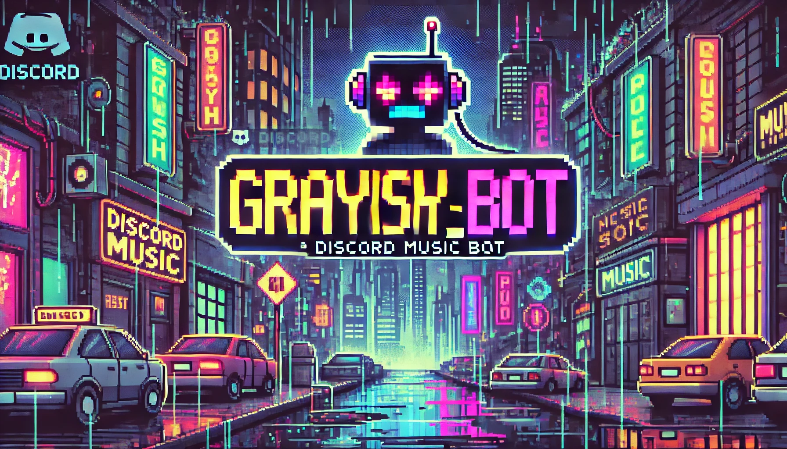

# 🎶 Discord Music Bot

> Un bot de música para Discord con soporte para reproducción de canciones desde **YouTube**, **Spotify** y **SoundCloud**. Este bot incluye características como una cola de canciones interactiva, controles de reproducción y otras funcionalidades personalizadas.

 <!-- Imagen simulada, actualiza más adelante -->

---

## 🌟 Características

- **Soporte de música** de YouTube, Spotify y SoundCloud.
- **Cola de canciones** interactiva con paginación.
- **Controles de reproducción** (pausar, reanudar, saltar, detener).
- **Comando de mezcla** para aleatorizar la cola de canciones.
- **Interfaz de control** con botones de interacción en Discord.
- **Respuestas personalizadas** para ciertos mensajes de texto.

---


## ⚙️ Requisitos

- **Node.js** v16 o superior
- **discord.js** v14
- **Clave de API de Discord** (para el bot) y **credenciales de Spotify** (si deseas usarlo)

---

## 🚀 Instalación

### Paso 1: Clonar el Repositorio
Clona este repositorio a tu máquina local usando el siguiente comando:

```bash
git clone https://github.com/TheGrayish/discord-music-bot.git
cd discord-music-bot
```

### Paso 2: Instalar Dependencias
Instala las dependencias necesarias:
```bash
npm install
```
### Paso 3: Configurar Variables de Entorno
Crea un archivo .env en la raíz del proyecto y añade tu token de Discord:
```bash
DISCORD_TOKEN=tu_token_de_discord
```
### Paso 4: Configurar config.json
```bash
{
  "prefix": "-",
  "token": "TU_DISCORD_TOKEN",
  "spotifyClientId": "TU_CLIENT_ID",
  "spotifySecret": "TU_CLIENT_SECRET"
}
```

## 🎮 Comandos

| Comando               | Descripción                                                               |
|-----------------------|---------------------------------------------------------------------------|
| `-play [nombre o URL]` | Reproduce una canción de YouTube, Spotify o SoundCloud.                 |
| `-pause`              | Pausa la canción actual.                                                 |
| `-resume`             | Reanuda la reproducción.                                                 |
| `-skip`               | Salta a la siguiente canción en la cola.                                 |
| `-stop`               | Detiene la reproducción y desconecta al bot.                             |
| `-showQueue`          | Muestra la cola de canciones en un mensaje paginado.                     |
| `-shuffle`            | Mezcla la cola de canciones aleatoriamente.                              |

## 📁 Estructura del Proyecto

```bash
discord-music-bot/
├── config.json          # Configuración de tokens y prefijo
├── index.js             # Código principal del bot
├── .env                 # Tokens de ambiente (no se sube a GitHub)
├── README.md            # Archivo README
└── public/              # Archivos públicos para el servidor Express
```

## 💻 Ejecución
Para iniciar el bot, utiliza el siguiente comando:

``` bash
node index.js
```

## 🤝 Contribución
### ¡Las contribuciones son bienvenidas! Si deseas contribuir:

Haz un fork del proyecto. \
Crea una rama para tus cambios (git checkout -b feature/nueva-funcionalidad).  \
Realiza un commit de tus cambios (git commit -m 'Agrega nueva funcionalidad'). \
Haz push de tu rama (git push origin feature/nueva-funcionalidad). \
Abre un pull request.

## 📞 Contacto
Desarrollado por [TheGrayish](https://github.com/TheGrayish). Si tienes alguna pregunta, no dudes en contactarme.


## ¡Gracias por usar Discord Music Bot! 🎶✨

